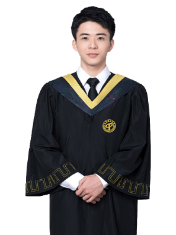
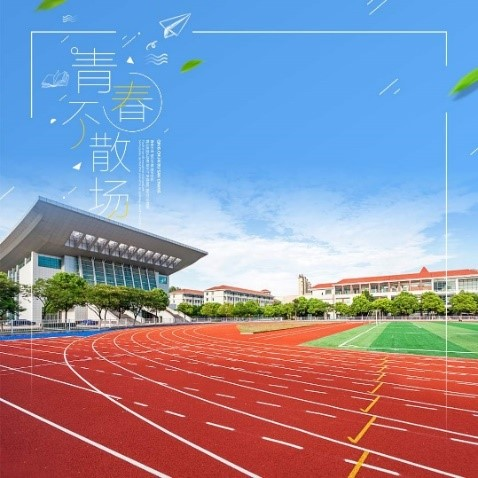
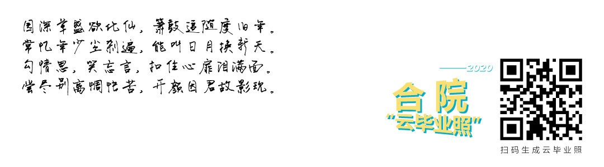
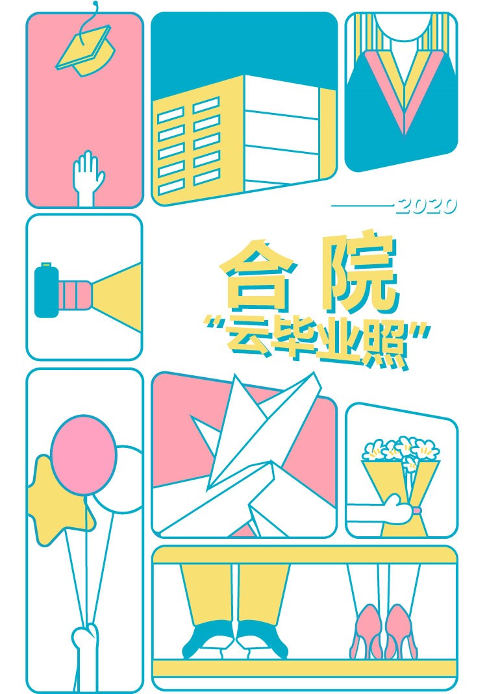

## 环境要求

	php: >=7.0
	redis extension
	phalcon extension

## 素材要求和修改
1.模特图片素材要求png格式背景透明；尺寸750 * 520；数量8到16张即可；大小100k左右；图片要清晰。替换路径public/images/boy1.png,girl1.png。代码修改：app/services/MergeFace.php 修改静态变量$models数组。


2.背景图片素材要求png，jpg格式；尺寸1080*1080；数量4到10张即可；大小100k左右；图片要清晰。替换路径public/images/bg1.jpg,bg2.jpg,bg3.jpg,bg4.jpg。代码修改：app/services/MergeFace.php 修改静态变量$bgs数组。


3.引流图片素材要求png，jpg格式；尺寸1080*300；大小50k左右；图片要清晰。替换路径public/images/drain.jpg。代码修改：app/controllers/ApiController.php 第25行。


4.主页图片素材要求svg格式；尺寸750*520。可使用Adobe illustrator软件打开public/images/bg-index.svg文件进行修改保存


5.其他按钮，提示图片素材，均可使用Adobe illustrator软件打开public/images目录下的.svg文件进行修改保存

6.微信分享文案修改app/controllers/IndexController.php 第18行的$share数组。

7.修改配置文件app/config/config.php  wexin配置，facePlusPlus配置。

## 安装使用

体验地址：[graduation.nivin.cn](http://graduation.nivin.cn/)

依赖安装

```bash
composer install
```

[Nginx服务器配置参考](https://www.kancloud.cn/jaya1992/phalcon_doc_zh/753243#Nginx_46)

[Apache服务器配置参考](https://www.kancloud.cn/jaya1992/phalcon_doc_zh/753243#Apache_148)

本系统使用[Phalcon](https://phalcon.io/zh-cn)框架，[中文开发文档](https://www.kancloud.cn/jaya1992/phalcon_doc_zh)
